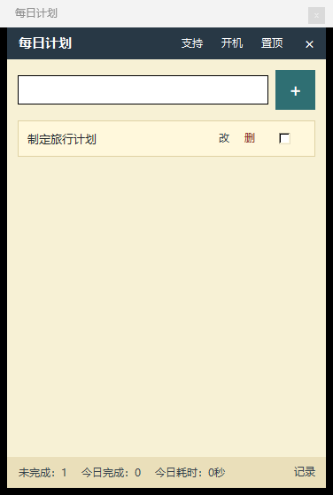

# Daily Plan Sticky / 每日计划便签

Daily Plan Sticky is a small Windows desktop app for keeping today's tasks visible and turning completed work into a local time log.

每日计划便签是一个轻量的 Windows 桌面工具：把当天任务贴在桌面上，完成后自动记录任务、日期和耗时。



## What It Does / 它能做什么

- Keeps a compact task note on your desktop.
- Runs from the system tray, without occupying the Windows taskbar.
- Adds tasks manually with Enter or the `+` button.
- Lets you edit, delete, and complete tasks.
- Hides completed tasks after a short fade.
- Saves completed items to `completed_tasks.csv`.
- Shows today's completed count and total time.
- Remembers window size, position, topmost mode, and startup preference.
- Stores data locally by default.

中文概括：

- 桌面悬浮显示今日任务。
- 运行后只保留右下角系统托盘图标，不占底部任务栏。
- 支持手动添加、编辑、删除和勾选完成。
- 完成后任务会短暂变灰，然后从当前列表隐藏。
- 自动把完成记录写入 `completed_tasks.csv`。
- 底部显示今日完成数量和累计耗时。
- 自动记住窗口位置、大小、置顶状态和开机启动设置。
- 默认本地保存，不需要账号。

## Download / 下载

Windows executable builds are available from the Releases page:

[GitHub Releases](https://github.com/klsk007/daily-plan-sticky/releases)

If no public release is visible yet, the latest build may still be in draft review.

## Run From Source / 从源码运行

Requirements:

- Windows
- Python 3.10+

Install dependencies:

```powershell
python -m pip install -r requirements.txt
```

Run:

```powershell
python daily_plan_sticky.py
```

Or double-click:

```text
启动每日计划便签.bat
```

## Build EXE / 打包 EXE

```powershell
python -m pip install pyinstaller
python -m PyInstaller --onefile --windowed --name DailyPlanSticky --icon assets\app-icon.ico --add-data "alipay_qr.png;." --add-data "assets\app-icon.ico;assets" daily_plan_sticky.py
```

The output file is:

```text
dist\DailyPlanSticky.exe
```

## Local Data / 本地数据

The app writes these files next to the script or executable:

| File | Purpose |
| --- | --- |
| `active_tasks.json` | Active unfinished tasks |
| `completed_tasks.csv` | Completed task log |
| `settings.json` | Window and startup settings |
| `alipay_qr.png` | Optional support/donation QR image |

These local user-data files are ignored by Git.

## Privacy / 隐私

Daily Plan Sticky is local-first. It does not require an account and does not upload task data by itself.

每日计划便签默认只在本地保存任务和完成记录，不需要账号，也不会主动上传任务数据。

This app is free to use and has no ads. If it saves you a few minutes writing daily reports or work logs, you can support continued maintenance from the in-app donation QR window.

这个小工具免费使用、没有广告。如果它帮你少写了几次日报、周报或工时记录，欢迎通过软件里的“支持”二维码请作者喝杯咖啡，支持继续维护。

## Use Cases / 适合场景

- Daily work planning
- Remote-work logs
- Freelance billing notes
- Research or lab daily records
- Daily report and weekly report material

适合：每日计划、远程办公记录、自由职业工时、科研/实验室日报、周报素材整理。

## License

MIT License.
